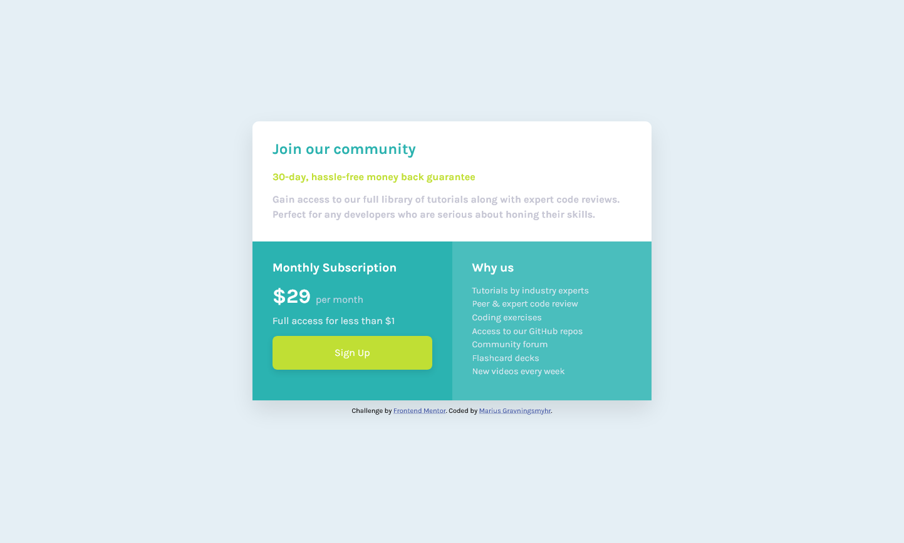

# Frontend Mentor - Single price grid component solution

This is a solution to the [Single price grid component challenge on Frontend Mentor](https://www.frontendmentor.io/challenges/single-price-grid-component-5ce41129d0ff452fec5abbbc). Frontend Mentor challenges help you improve your coding skills by building realistic projects.

## Table of contents

- [Overview](#overview)
  - [The challenge](#the-challenge)
  - [Screenshot](#screenshot)
  - [Links](#links)
- [My process](#my-process)
  - [Built with](#built-with)
  - [What I learned](#what-i-learned)
  - [Continued development](#continued-development)
  - [Useful resources](#useful-resources)
- [Author](#author)

## Overview

### The challenge

Users should be able to:

- View the optimal layout for the component depending on their device's screen size
- See a hover state on desktop for the Sign Up call-to-action

### Screenshot

### Links

- Solution URL: [Add solution URL here](https://your-solution-url.com)
- Live Site URL: [Add live site URL here](https://your-live-site-url.com)

## My process

### Built with

- Semantic HTML5 markup
- CSS
- CSS custom properties
- Flexbox

### What I learned

I've learned how to utilize flexbox to layout my page and make it responsive on tablet and mobile devices.

### Continued development

I'm going to enhance my HTML and CSS skills by continue creating more sites and adding javaScript to make the sites interactive.

### Useful resources

- [Responsive design made easy by Kevin Powell](https://www.youtube.com/watch?v=bn-DQCifeQQ) - This helped me when I was creating the tablet and mobile version.

## Author

- Frontend Mentor - [@mariusgrHiof](https://www.frontendmentor.io/profile/mariusgrHiof)
- Twitter - [@Marius22261747](https://www.twitter.com/Marius22261747)
